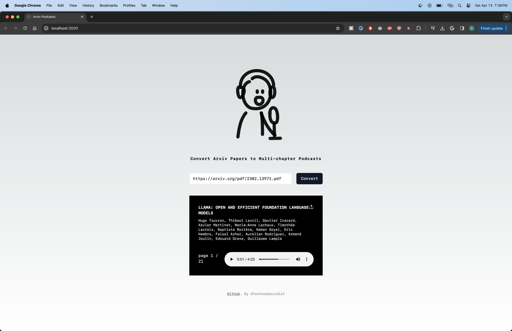

<div align="center">
    
    <h1>Arxiv Research Pods</h1>
    <h5>Convert Arxiv Papers into multi-chapter Podcasts</h5>
</div>


## Getting Started

Install dependencies: 

```
npm install
```

Set up environment variables: 

```
OPENAI_API_KEY=your_openai_api_key
```

Run the development server:

```bash
npm run dev
```

Open [http://localhost:3000](http://localhost:3000) with your browser to see the result.

Usage should look something like this: 

<div align="center">
    
</div>

You can start editing the page by modifying `app/page.tsx`. The page auto-updates as you edit the file.


## Contribute

All contributions are welcome! 


